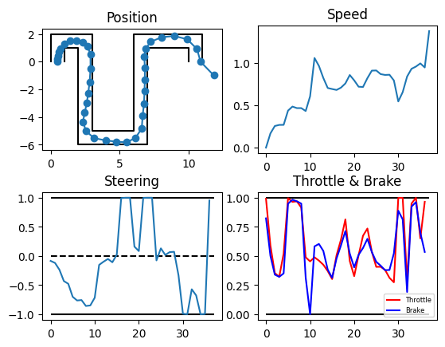
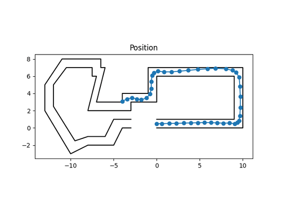
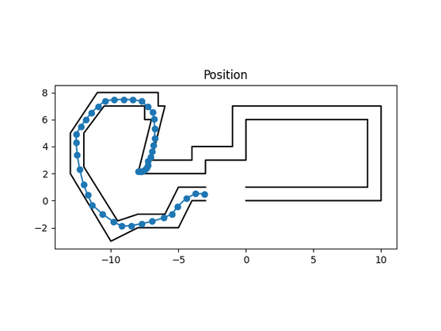

# simple-autonomous-car

* Aiming to create skilled driver agent

* Good driving anywhere even for the first time

* Reinforcement learning for training

## Implementation

### Model

* Structure
    * Inputs
        1. Wall distance (like LiDAR)
        2. Car speed

    * Outputs
        1. Steering [-1, 1]
        2. Throttle [0, 1]
        3. Brake    [0, 1]

* To satisfy smooth driving, agent takes continuous action

* Agent is implemented on *DDPG* algorithm

Car setting file should be like...

```ts
type carModelConfig = {
    "max_steering_angle": number;       // degree
    "acceleration_g": number;           // engine power
    "deceleration_g": number;           // brake power
    "lidar_range": number;              // wall detectable distance
    "sensor_directions": Array<number>; // degree, zero-centered
}
```

Car settings are defined in *config/car_model_config.json*.


### Environment

Course layout file should be like...

```ts
type numberWithInf = number | "inf" | "-inf";

type courseLayout = {
    "initial_position": { "x": number, "y": number };
    "initial_direction": number;    // degree
    "max_step": number;             // max count agent could take
    "off_limits_areas": Array<{     // if agent comes in, then episode ends
        "x": { "min": numberWithInf, "max": numberWithInf },
        "y": { "min": numberWithInf, "max": numberWithInf },
    }>;
    "goal_area": {
        "x": { "min": numberWithInf, "max": numberWithInf },
        "y": { "min": numberWithInf, "max": numberWithInf },
    };
    "course": {                     // list of wall vertex
        "left_wall": Array<{ "x": number, "y": number }>;
        "right_wall": Array<{ "x": number, "y": number }>;
    };
}
```

Course setting is defined in *course_layouts* dir.

### Rewards

* Reward
    * Distance gained

* Penalty

    * Wall collision

    * Default penalty for motivation

    * ~~Step on throttle & brake simultaneously~~

Rewards are defined in *config/reward_config.json*

## Usage

1. Edit hyperparameters & config filepath in *main.py*

2. Run `python3 main.py [-h] [--play] [--log]`
    * `--play` : Greedy play by trained model
    * `--log` : Export image & pickle file in `LOG_DIR`

Otherwise, *run.sh* would help.
```console
Usage: bash run.sh [target_reward]

Arguments: 
	target_reward	if reward >= target_reward, then exit
```

This script runs forever untill trained agent scores over `target_reward`.

## Results

### Train

After 400 episodes training in crank layout,



### Test data

In first-look layout,





cf. *Baku City Circuit - Azerbaijan Grand Prix*
